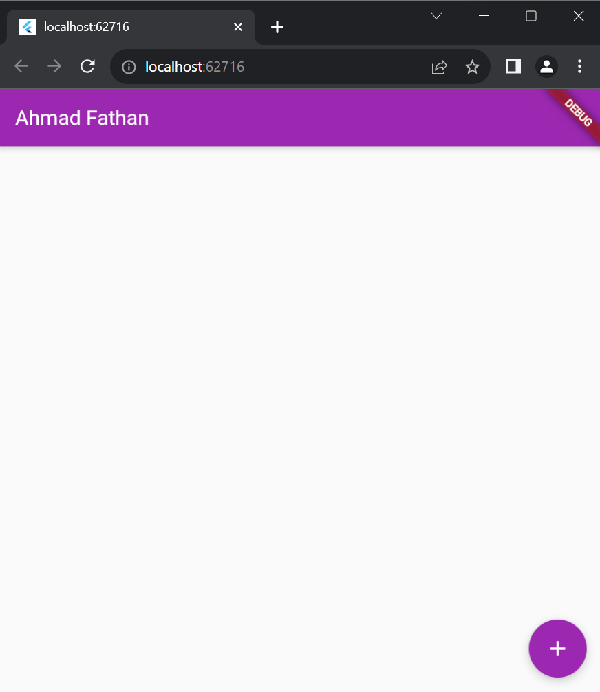
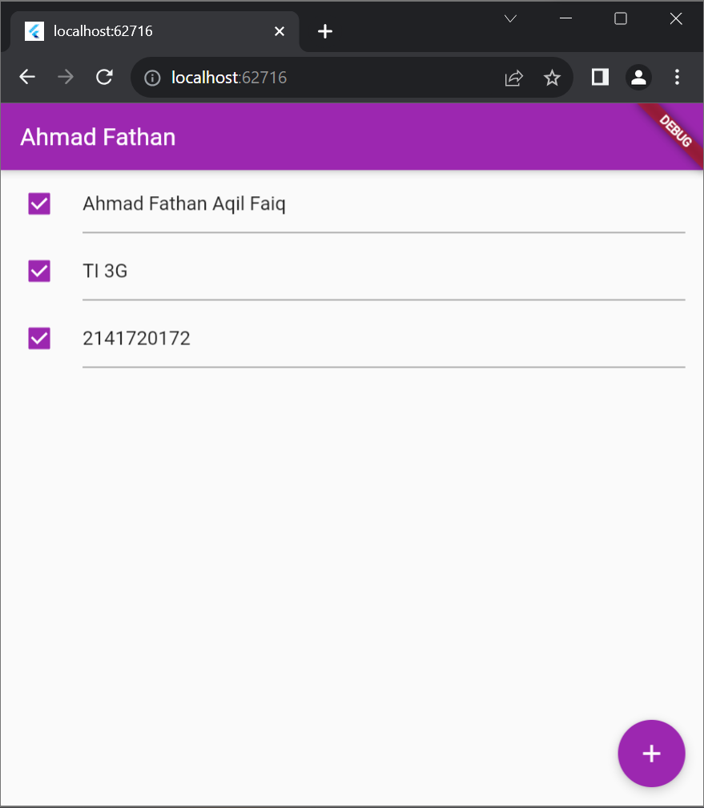

# Pemrograman Mobile Minggu 12

Nama  : Ahmad Fathan Aqil Faiq<br>
Kelas : TI - 3G<br>
NIM   : 2141720172<br>

---

## Praktikum 1 : Dasar State dengan Model-View

### Langkah 1 : Buat Project Baru

### Langkah 2 : Membuat model task.dart

```
class Task {
  final String description;
  final bool complete;

  const Task({
    this.complete = false,
    this.description = '',
  });
}
```

### Langkah 3: Buat file plan.dart

```
import './task.dart';

class Plan {
  final String name;
  final List<Task> tasks;

  const Plan({this.name = '', this.tasks = const []});
}
```

### Langkah 4: Buat file data_layer.dart

```
export 'plan.dart';
export 'task.dart';
```

### Langkah 5: Pindah ke file main.dart

```
import 'package:flutter/material.dart';
import './views/plan_screen.dart';

void main() => runApp(MasterPlanApp());

class MasterPlanApp extends StatelessWidget {
  const MasterPlanApp({super.key});

  @override
  Widget build(BuildContext context) {
    return MaterialApp(
     theme: ThemeData(primarySwatch: Colors.purple),
     home: PlanScreen(),
    );
  }
}
```

### Langkah 6: buat plan_screen.dart

```
import '../models/data_layer.dart';
import 'package:flutter/material.dart';

class PlanScreen extends StatefulWidget {
  const PlanScreen({super.key});

  @override
  State createState() => _PlanScreenState();
}

class _PlanScreenState extends State<PlanScreen> {
  Plan plan = const Plan();

  @override
  Widget build(BuildContext context) {
   return Scaffold(
    // ganti ‘Namaku' dengan Nama panggilan Anda
    appBar: AppBar(title: const Text('Master Plan Namaku')),
    body: _buildList(),
    floatingActionButton: _buildAddTaskButton(),
   );
  }
}
```

### Langkah 7: buat method \_buildAddTaskButton()

```
Widget _buildAddTaskButton() {
  return FloatingActionButton(
   child: const Icon(Icons.add),
   onPressed: () {
     setState(() {
      plan = Plan(
       name: plan.name,
       tasks: List<Task>.from(plan.tasks)
       ..add(const Task()),
     );
    });
   },
  );
}
```

### Langkah 8: buat widget \_buildList()

```
Widget _buildList() {
  return ListView.builder(
   itemCount: plan.tasks.length,
   itemBuilder: (context, index) =>
   _buildTaskTile(plan.tasks[index], index),
  );
}
```

### Langkah 9: buat widget \_buildTaskTile

```
Widget _buildTaskTile(Task task, int index) {
    return ListTile(
      leading: Checkbox(
          value: task.complete,
          onChanged: (selected) {
            setState(() {
              plan = Plan(
                name: plan.name,
                tasks: List<Task>.from(plan.tasks)
                  ..[index] = Task(
                    description: task.description,
                    complete: selected ?? false,
                  ),
              );
            });
          }),
      title: TextFormField(
        initialValue: task.description,
        onChanged: (text) {
          setState(() {
            plan = Plan(
              name: plan.name,
              tasks: List<Task>.from(plan.tasks)
                ..[index] = Task(
                  description: text,
                  complete: task.complete,
                ),
            );
          });
        },
      ),
    );
  }
```

Run atau tekan F5 untuk melihat hasil aplikasi yang Anda telah buat. Capture hasilnya untuk soal praktikum nomor 4.



### Langkah 10: Tambah Scroll Controller

```
late ScrollController scrollController;
```

### Langkah 11: Tambah Scroll Listener


```
@override
void initState() {
  super.initState();
  scrollController = ScrollController()
    ..addListener(() {
      FocusScope.of(context).requestFocus(FocusNode());
    });
}
```

### Langkah 12: Tambah controller dan keyboard behavior

```
return ListView.builder(
  controller: scrollController,
 keyboardDismissBehavior: Theme.of(context).platform ==
 TargetPlatform.iOS
          ? ScrollViewKeyboardDismissBehavior.onDrag
          : ScrollViewKeyboardDismissBehavior.manual,
```

### Langkah 13: Terakhir, tambah method dispose()

```
@override
void dispose() {
  scrollController.dispose();
  super.dispose();
}
```

### Langkah 14: Hasil



2. Jelaskan maksud dari langkah 4 pada praktikum tersebut! Mengapa dilakukan demikian?

Jawab : Perintah export digunakan untuk membuat dua file Dart, yaitu plan.dart dan task.dart, dapat diakses oleh file Dart lainnya. Ini memungkinkan penggunaan class, fungsi, atau variabel yang didefinisikan dalam kedua file tersebut di dalam file Dart lain yang mengimportnya.

3. Mengapa perlu variabel plan di langkah 6 pada praktikum tersebut? Mengapa dibuat konstanta ?

Jawab : Variabel plan diinisialisasi sebagai konstanta (const) karena nilainya dianggap tidak akan berubah sepanjang siklus hidup widget \_PlanScreenState. Penggunaan const memberikan kejelasan, dapat mendukung optimasi kompilasi, dan membantu menghindari perubahan tidak diinginkan pada nilai tersebut. Namun, perlu dicatat bahwa sifat konstan hanya berlaku untuk referensi objek dan tidak mengontrol mutabilitas objek itu sendiri.

4. Lakukan capture hasil dari Langkah 9 berupa GIF, kemudian jelaskan apa yang telah Anda buat!


Penjelasan -> Membuat tampilan untuk menambahkan textfield dan terdapat cek box yang bisa dicek list

5. Apa kegunaan method pada Langkah 11 dan 13 dalam lifecyle state ?

Jawab : Kode langkah 11 berada dalam metode initState() suatu widget Flutter. Pada saat widget diinisialisasi, fungsi ini dijalankan. Kode tersebut membuat dan mengatur scrollController, yang merupakan kontroler gulir. Sedangkan kode langkah 13 berada dalam metode dispose(), yang dijalankan ketika widget dihancurkan. Pada saat widget dihapus, scrollController dihancurkan dengan memanggil dispose(). Ini penting untuk mencegah kebocoran memori dan mengelola sumber daya dengan baik. super.dispose() juga dipanggil untuk memastikan bahwa metode dispose() dari superclass (kelas induk) juga dijalankan.
